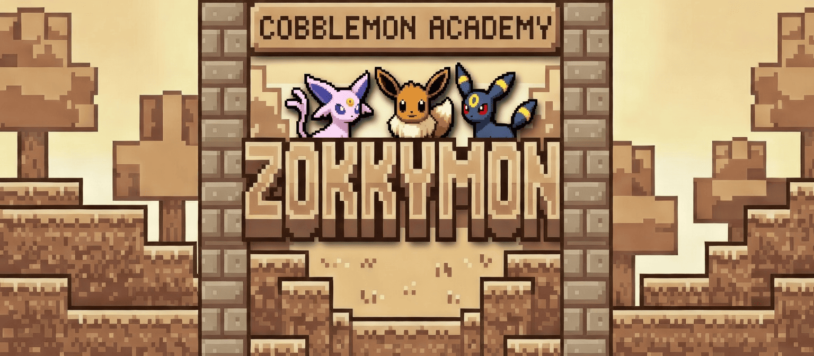

  

<h1 align="center">Launcher Zokkymon</h1>

Un launcher personnalisé créé par <b>Zokkyen</b> pour jouer entre amis à un modpack basé sur Cobblemon Academy 2.

---

## 🎮 À propos du projet

**Launcher Zokkymon** est un projet personnel développé dans le but de jouer entre amis dans un environnement sécurisé et communautaire.

Ce launcher permet :

- L'installation automatique du modpack
- La gestion des mises à jour
- Une connexion simplifiée au serveur
- Une expérience optimisée pour notre communauté

Il n’a **aucun objectif commercial**.

---

## 🌍 Objectif

Créer un espace de jeu privé autour de **Cobblemon Academy 2**, avec :

- Une infrastructure stable
- Un serveur sécurisé
- Une gestion propre des versions
- Un esprit communautaire

Ce projet est développé uniquement pour le plaisir et le partage.

---

## 🔐 Sécurité

Le serveur fonctionne avec :

- `online-mode=true`
- Whitelist activée
- Vérification d’authentification officielle Microsoft/Minecraft
- Distribution contrôlée du modpack

L’objectif est de garantir :

- Une expérience sécurisée
- Aucune usurpation d’identité
- Un environnement sain

---

## ⚙️ Fonctionnalités du launcher

- Installation automatique de Java
- Installation de Fabric
- Téléchargement automatique du modpack
- Vérification des mises à jour
- Interface personnalisée

---

## 📦 À propos du modpack

Le modpack est basé sur **Cobblemon Academy 2** et peut inclure des ajustements spécifiques pour notre serveur.

Ce launcher n’est pas affilié aux créateurs officiels du modpack.

---

## ⚠️ Disclaimer

Ce projet :

- N’est pas affilié à Mojang, Microsoft ou aux créateurs de Cobblemon.
- N’a aucun but commercial.
- Ne distribue aucun contenu payant.
- Nécessite un compte Minecraft officiel valide.

---

## 👤 Auteur

Développé par **Zokkyen**  
Projet communautaire privé.

---

Fait avec passion pour jouer entre amis 💛

