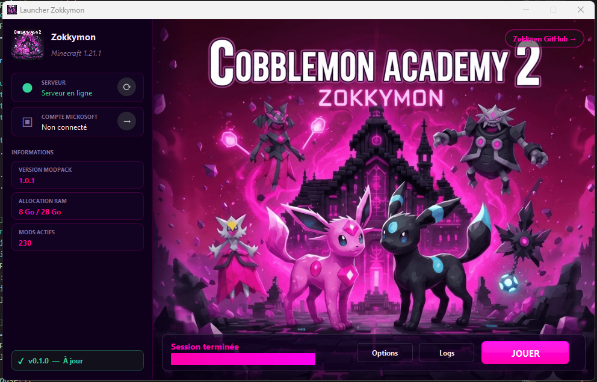

  

<h1 align="center">Launcher Zokkymon</h1>

Un launcher fait maison par <b>Zokkyen</b> pour lancer Zokkymon facilement entre amis, sans prise de tête.

---

## 🎮 À propos du projet

**Launcher Zokkymon** est un projet perso/communautaire pour simplifier la vie des joueurs : tu installes, tu te connectes, tu joues.

Ce launcher permet :

- D’installer automatiquement le modpack
- De garder le jeu à jour
- De se connecter simplement au serveur
- D’avoir une expérience stable pour toute la communauté

Il n’a **aucun objectif commercial**.

---

## 🌍 Objectif

Créer un espace de jeu privé autour de **Cobblemon Academy 2**, avec :

- Une infrastructure stable
- Un serveur sécurisé
- Une gestion propre des versions
- Un esprit communautaire

Le but est simple : jouer ensemble dans de bonnes conditions, avec un launcher fiable et agréable à utiliser.

---

## 🔐 Sécurité

Le serveur fonctionne avec :

- `online-mode=true`
- Whitelist activée
- Vérification d’authentification officielle Microsoft/Minecraft
- Distribution contrôlée du modpack

L’idée, c’est de garantir :

- Une expérience sécurisée
- Aucune usurpation d’identité
- Un environnement sain

---

## ⚙️ Fonctionnalités du launcher

- Installation automatique de Java
- Installation de Fabric
- Téléchargement et mise à jour automatiques du modpack (vérification SHA-256)
- Progression unifiée lors du téléchargement et de l'extraction
- Authentification officielle Microsoft / Minecraft
- Interface en mode **clair** ou **sombre** (bascule intégrée)
- Stockage sécurisé des tokens (chiffrement AES-256-GCM)

---

## 📦 À propos du modpack

Le modpack est basé sur **Cobblemon Academy 2** et peut inclure des ajustements spécifiques pour notre serveur.

Ce launcher n’est pas affilié aux créateurs officiels du modpack.

---

## 🔄 Mises à jour

- Les versions de test sortent d’abord en **beta**.
- Les versions stables arrivent ensuite sur **main** (celle recommandée pour tout le monde).
- À chaque release, l’EXE et les infos de version sont publiés automatiquement.

---

## ⚠️ Disclaimer

Ce projet :

- N’est pas affilié à Mojang, Microsoft ou aux créateurs de Cobblemon.
- N’a aucun but commercial.
- Ne distribue aucun contenu payant.
- Nécessite un compte Minecraft officiel valide.
- Les images sont, pour le moment, générées par IA et seront remplacées progressivement.

---

## 👤 Auteur

Développé par **Zokkyen**  
Projet communautaire privé.

---

Fait avec passion pour jouer entre amis 💛

